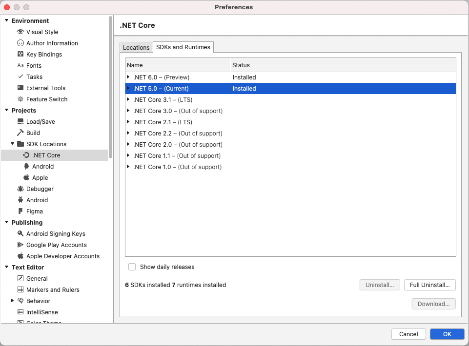
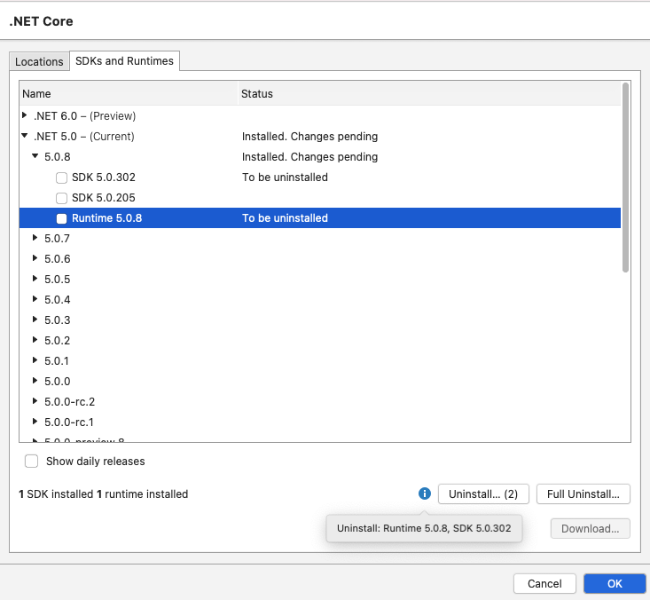
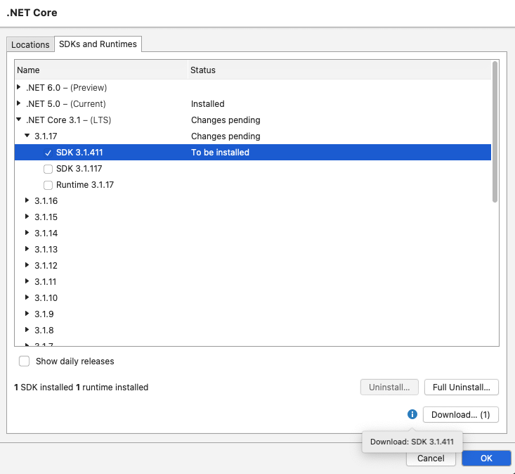
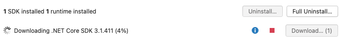
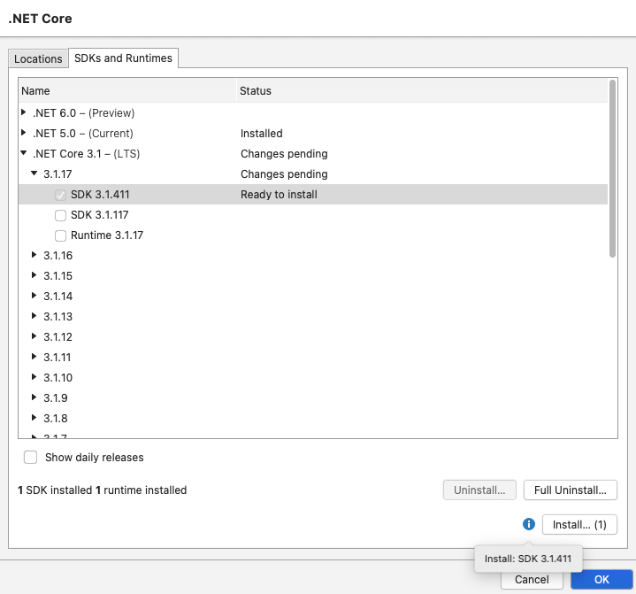
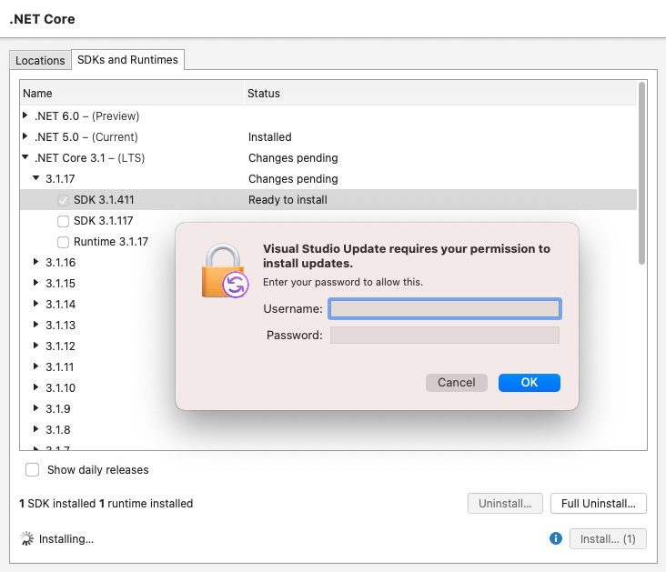

# .NET Core Extensions for Visual Studio for Mac

Extends the .NET Core support provided in Visual Studio for Mac.

Features:

 - Supports installing public SDKs and runtimes
 - Supports installing daily SDK and runtime releases from http://github.com/dotnet/installer
 - Supports uninstalling individual SDKs and runtimes
 - Supports completely uninstalling .NET from the machine

There is no support currently for .NET workloads.

## Managing .NET SDKs and Runtimes

.NET SDKs and Runtimes can be managed from
Preferences - Projects - SDK Locations - .NET Core - SDKs and Runtimes

### Full Uninstall

To completely uninstall .NET from your machine click the
Full Uninstall button.

You will be prompted for your username and password
before .NET can be uninstalled from your machine.

The uninstall is based on the [uninstall script](https://github.com/dotnet/sdk/blob/main/scripts/obtain/uninstall/dotnet-uninstall-pkgs.sh) from https://github.com/dotnet/sdk

There is no support for .NET workloads currently.

## Uninstalling SDKs and Runtimes

To uninstall a specific SDK or runtime, expand the items and
uncheck the SDK or runtime.

Click the Uninstall button to run
the uninstall. You will be prompted for your username and
password so the uninstall can be run.

## Installing SDKs and Runtimes

To install an SDK or runtime, expand the items and check the
SDK or runtime.

Click the Download button to download the
.pkg files.

Once the download is finished you can click the
Install button to install the SDKs and runtimes downloaded.

This will open Visual Studio for Mac's Updater to install the
selected SDKs and runtimes.

